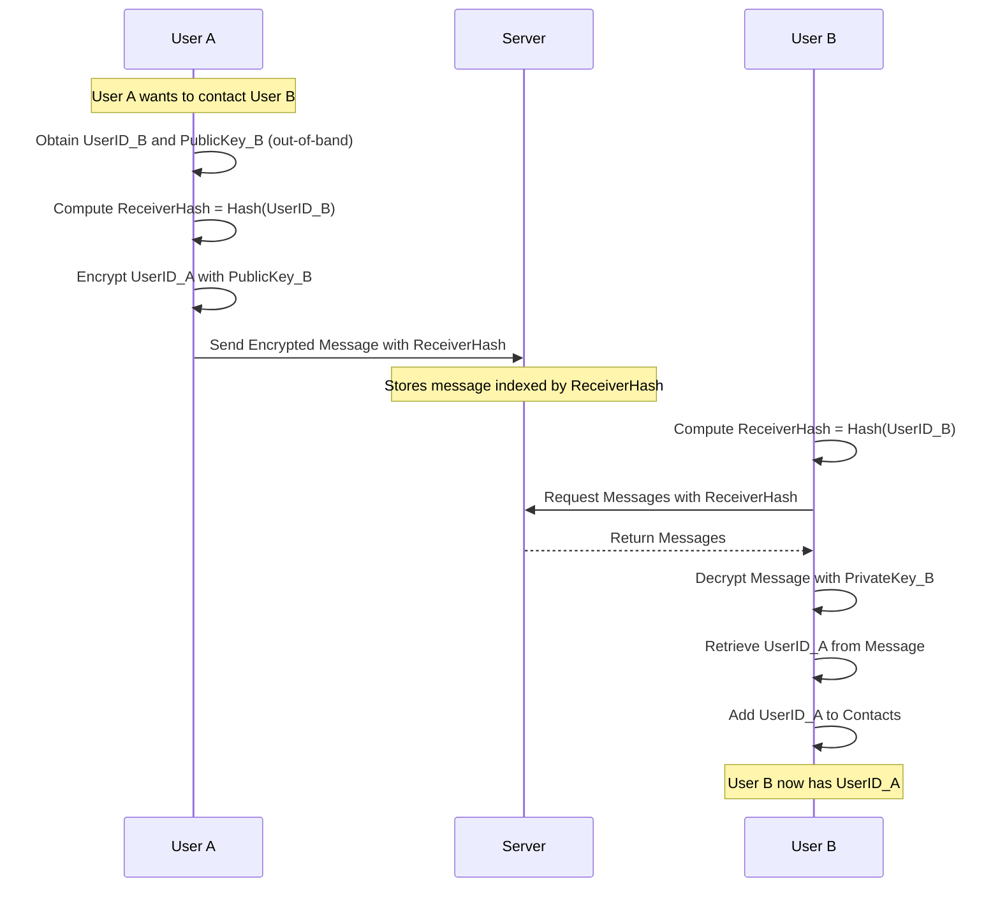
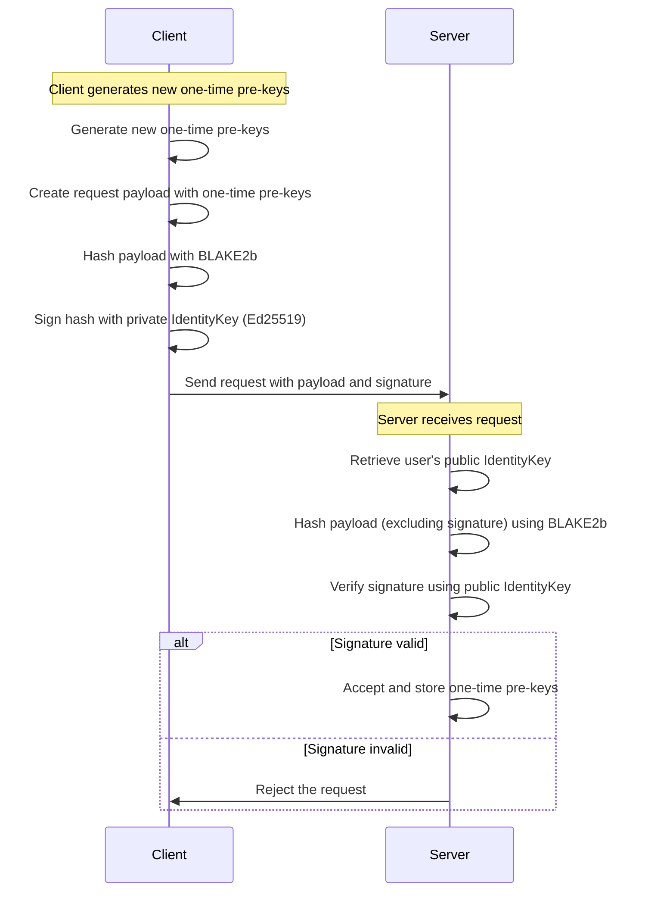
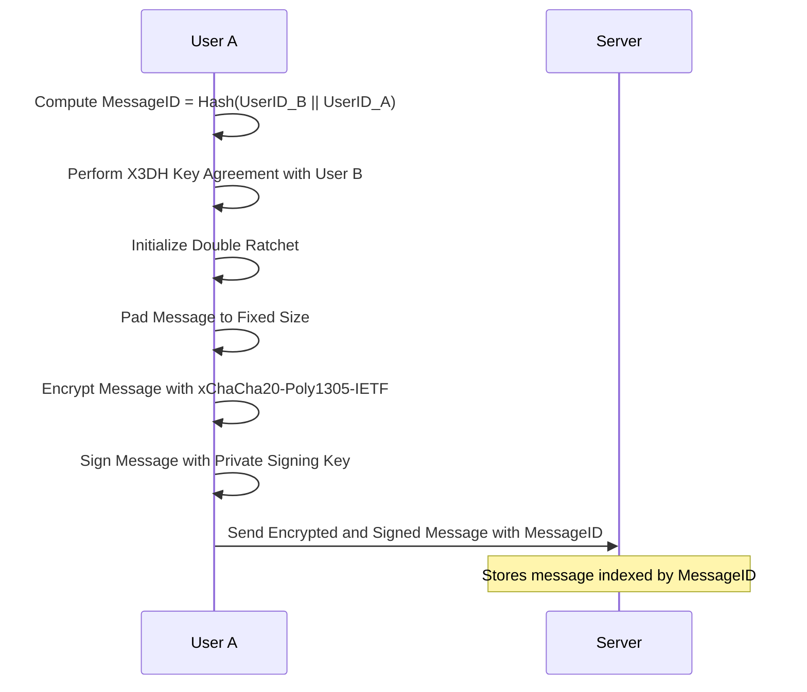
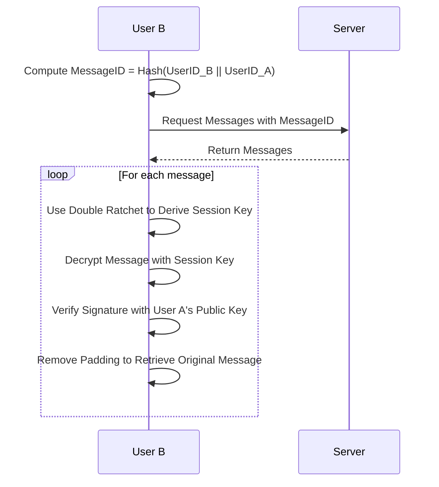
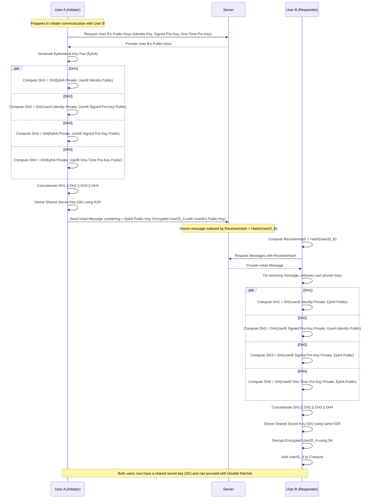
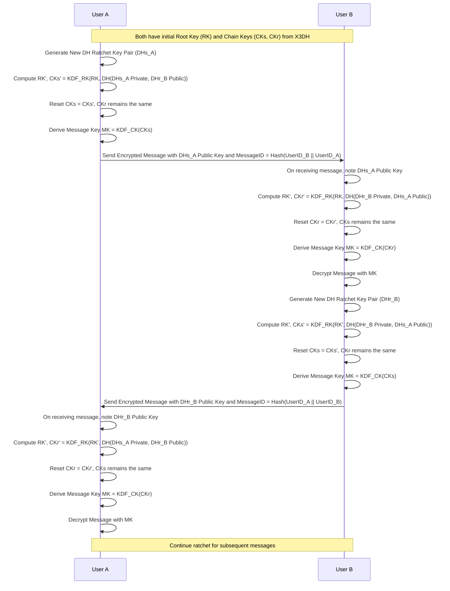

# Diagramms

## Initial Contact

```mermaid
sequenceDiagram
    participant UserA as User A
    participant Server
    participant UserB as User B

    Note over UserA: User A wants to contact User B
    UserA->>UserA: Obtain UserID_B and PublicKey_B (out-of-band)
    UserA->>UserA: Compute ReceiverHash = Hash(UserID_B)
    UserA->>UserA: Encrypt UserID_A with PublicKey_B
    UserA->>Server: Send Encrypted Message with ReceiverHash

    Note over Server: Stores message indexed by ReceiverHash

    UserB->>UserB: Compute ReceiverHash = Hash(UserID_B)
    UserB->>Server: Request Messages with ReceiverHash
    Server-->>UserB: Return Messages
    UserB->>UserB: Decrypt Message with PrivateKey_B
    UserB->>UserB: Retrieve UserID_A from Message
    UserB->>UserB: Add UserID_A to Contacts

    Note over UserB: User B now has UserID_A


```

## Uploading PreKeys

```mermaid
sequenceDiagram
    participant Client as Client
    participant Server as Server

    Note over Client: Client generates new one-time pre-keys
    Client->>Client: Generate new one-time pre-keys
    Client->>Client: Create request payload with one-time pre-keys
    Client->>Client: Hash payload with BLAKE2b
    Client->>Client: Sign hash with private IdentityKey (Ed25519)
    Client->>Server: Send request with payload and signature

    Note over Server: Server receives request
    Server->>Server: Retrieve user's public IdentityKey
    Server->>Server: Hash payload (excluding signature) using BLAKE2b
    Server->>Server: Verify signature using public IdentityKey
    alt Signature valid
        Server->>Server: Accept and store one-time pre-keys
    else Signature invalid
        Server->>Client: Reject the request
    end
```

## Sending Messages

```mermaid
sequenceDiagram
    participant UserA as User A
    participant Server

    UserA->>UserA: Compute MessageID = Hash(UserID_B || UserID_A)
    UserA->>UserA: Perform X3DH Key Agreement with User B
    UserA->>UserA: Initialize Double Ratchet
    UserA->>UserA: Pad Message to Fixed Size
    UserA->>UserA: Encrypt Message with xChaCha20-Poly1305-IETF
    UserA->>UserA: Sign Message with Private Signing Key
    UserA->>Server: Send Encrypted and Signed Message with MessageID

    Note over Server: Stores message indexed by MessageID

```
## Receiving Messages

```mermaid
sequenceDiagram
    participant UserB as User B
    participant Server

    UserB->>UserB: Compute MessageID = Hash(UserID_B || UserID_A)
    UserB->>Server: Request Messages with MessageID
    Server-->>UserB: Return Messages
    loop For each message
        UserB->>UserB: Use Double Ratchet to Derive Session Key
        UserB->>UserB: Decrypt Message with Session Key
        UserB->>UserB: Verify Signature with User A's Public Key
        UserB->>UserB: Remove Padding to Retrieve Original Message
    end
```

## X3DH

```mermaid
sequenceDiagram
    participant UserA as User A (Initiator)
    participant Server
    participant UserB as User B (Responder)

    Note over UserA: Prepares to initiate communication with User B

    UserA->>Server: Request User B's Public Keys (Identity Key, Signed Pre-Key, One-Time Pre-Key)
    Server-->>UserA: Provide User B's Public Keys

    UserA->>UserA: Generate Ephemeral Key Pair (EphA)

    par DH1
        UserA->>UserA: Compute DH1 = DH(EphA Private, UserB Identity Public)
    and DH2
        UserA->>UserA: Compute DH2 = DH(UserA Identity Private, UserB Signed Pre-Key Public)
    and DH3
        UserA->>UserA: Compute DH3 = DH(EphA Private, UserB Signed Pre-Key Public)
    and DH4
        UserA->>UserA: Compute DH4 = DH(EphA Private, UserB One-Time Pre-Key Public)
    end

    UserA->>UserA: Concatenate DH1 || DH2 || DH3 || DH4
    UserA->>UserA: Derive Shared Secret Key (SK) using KDF

    UserA->>Server: Send Initial Message containing = EphA Public Key, Encrypted UserID_A (with UserB's Public Key)

    Note over Server: Stores message indexed by ReceiverHash = Hash(UserID_B)

    UserB->>UserB: Compute ReceiverHash = Hash(UserID_B)
    UserB->>Server: Request Messages with ReceiverHash
    Server-->>UserB: Provide Initial Message

    UserB->>UserB: On receiving message, retrieves own private keys

    par DH1
        UserB->>UserB: Compute DH1 = DH(UserB Identity Private, EphA Public)
    and DH2
        UserB->>UserB: Compute DH2 = DH(UserB Signed Pre-Key Private, UserA Identity Public)
    and DH3
        UserB->>UserB: Compute DH3 = DH(UserB Signed Pre-Key Private, EphA Public)
    and DH4
        UserB->>UserB: Compute DH4 = DH(UserB One-Time Pre-Key Private, EphA Public)
    end

    UserB->>UserB: Concatenate DH1 || DH2 || DH3 || DH4
    UserB->>UserB: Derive Shared Secret Key (SK) using same KDF

    UserB->>UserB: Decrypt Encrypted UserID_A using SK
    UserB->>UserB: Add UserID_A to Contacts

    Note over UserA,UserB: Both users now have a shared secret key (SK) and can proceed with Double Ratchet

```
## DoubleRatchet

```mermaid
sequenceDiagram
    participant UserA as User A
    participant UserB as User B

    Note over UserA,UserB: Both have initial Root Key (RK) and Chain Keys (CKs, CKr) from X3DH

    %% User A sends first message with new DH ratchet key
    UserA->>UserA: Generate New DH Ratchet Key Pair (DHs_A)
    UserA->>UserA: Compute RK', CKs' = KDF_RK(RK, DH(DHs_A Private, DHr_B Public))
    UserA->>UserA: Reset CKs = CKs', CKr remains the same
    UserA->>UserA: Derive Message Key MK = KDF_CK(CKs)
    UserA->>UserB: Send Encrypted Message with DHs_A Public Key and MessageID = Hash(UserID_B || UserID_A)

    UserB->>UserB: On receiving message, note DHs_A Public Key
    UserB->>UserB: Compute RK', CKr' = KDF_RK(RK, DH(DHr_B Private, DHs_A Public))
    UserB->>UserB: Reset CKr = CKr', CKs remains the same
    UserB->>UserB: Derive Message Key MK = KDF_CK(CKr)
    UserB->>UserB: Decrypt Message with MK

    %% User B replies with new DH ratchet key
    UserB->>UserB: Generate New DH Ratchet Key Pair (DHr_B)
    UserB->>UserB: Compute RK', CKs' = KDF_RK(RK', DH(DHr_B Private, DHs_A Public))
    UserB->>UserB: Reset CKs = CKs', CKr remains the same
    UserB->>UserB: Derive Message Key MK = KDF_CK(CKs)
    UserB->>UserA: Send Encrypted Message with DHr_B Public Key and MessageID = Hash(UserID_A || UserID_B)

    UserA->>UserA: On receiving message, note DHr_B Public Key
    UserA->>UserA: Compute RK', CKr' = KDF_RK(RK', DH(DHs_A Private, DHr_B Public))
    UserA->>UserA: Reset CKr = CKr', CKs remains the same
    UserA->>UserA: Derive Message Key MK = KDF_CK(CKr)
    UserA->>UserA: Decrypt Message with MK

    Note over UserA,UserB: Continue ratchet for subsequent messages
```
