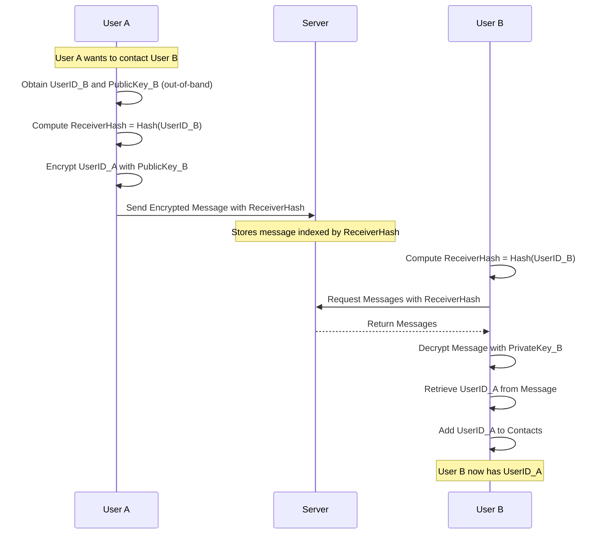
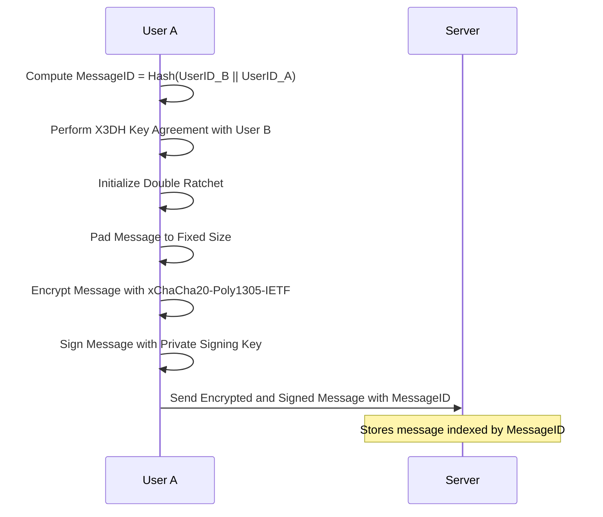
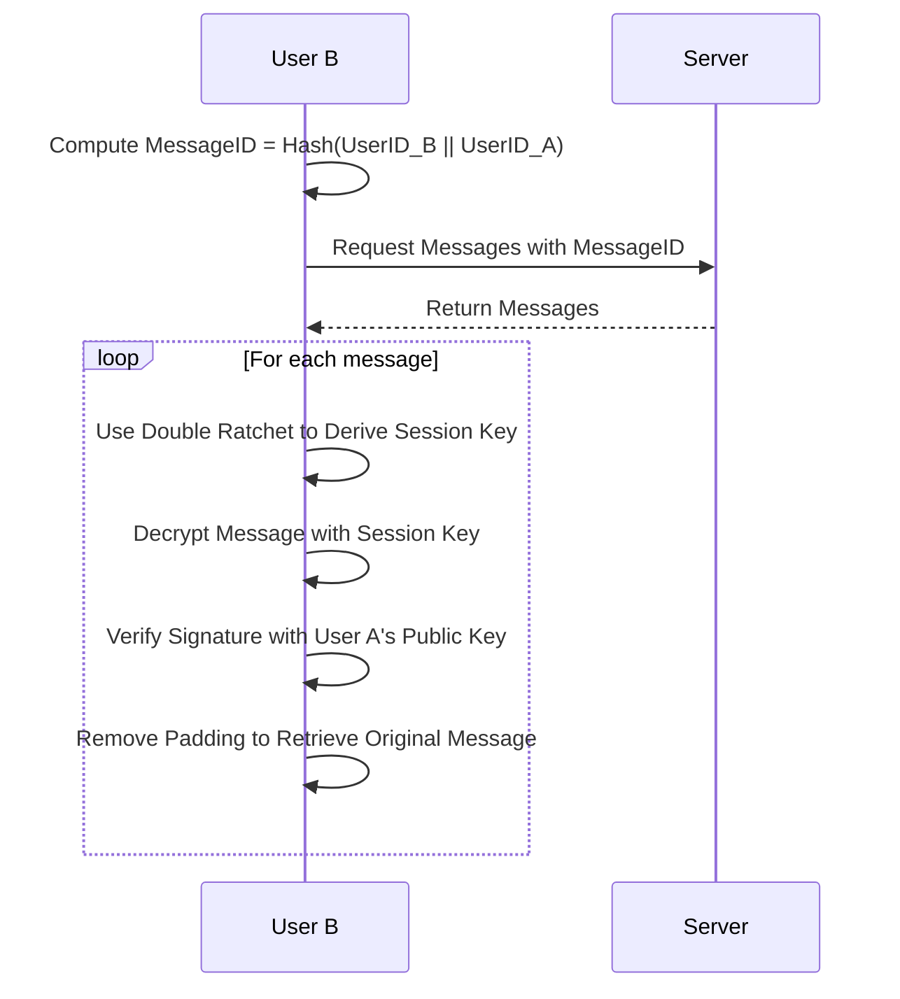
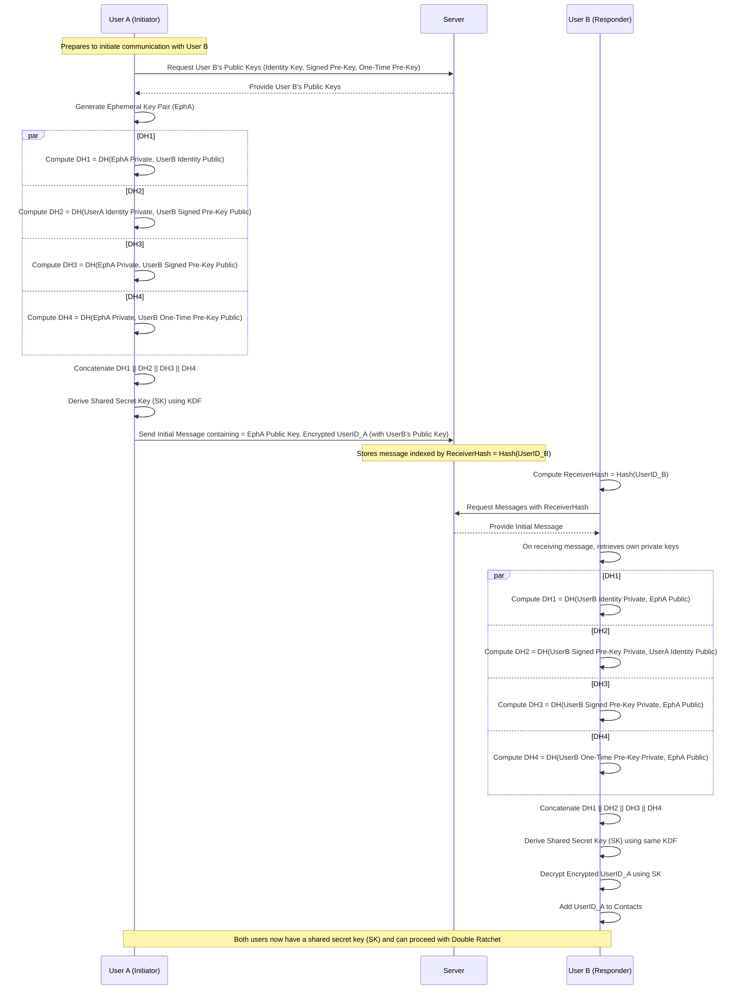
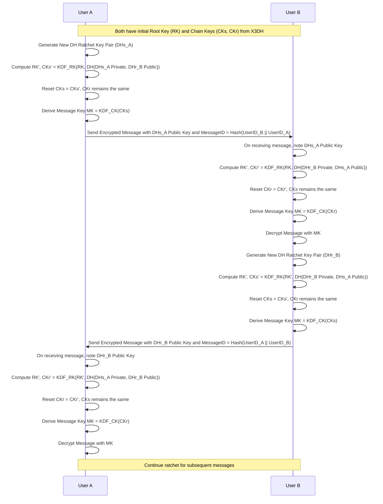

# Whispurr
A E2E Messenger inspired by Signal

# Short Overview of the Secure Messenger Application
## Components

### Client Application
        Key Management: Generates and manages cryptographic keys, including long-term identity keys and ephemeral session keys.
        Encryption and Signing: Performs message encryption using xChaCha20-Poly1305-IETF and signs messages with Ed25519 keys.
        User Interface: Handles all user interactions, message composition, and display.
### Server
        Key Storage: Stores users' public keys associated with their UserIDs, which are derived from their public signing keys.
        Message Relay: Stores and forwards encrypted messages without accessing their content or knowing the identities of the sender and receiver.
        Data Storage: Utilizes an SQL backend to store public keys and messages in encrypted form.

## Cryptographic Components

    UserIDs
        Derived by hashing the user's public signing key using BLAKE2b.
        Ensures uniqueness and binds the UserID to the user's public key, preventing impersonation.

    Key Agreement Protocol
        X3DH (Extended Triple Diffie-Hellman): Establishes an initial shared secret between users for secure communication.

    Message Encryption
        xChaCha20-Poly1305-IETF: Provides authenticated encryption with a nonce, ensuring confidentiality and integrity of messages.

    Message Signing
        Ed25519: Used for signing messages to verify the sender's identity and protect against tampering.

    Key Derivation
        Argon2: Utilized where necessary for secure key derivation, adding resistance against brute-force attacks.

    Forward Secrecy and Post-Compromise Security
        Double Ratchet Algorithm: Works with X3DH to continuously update encryption keys, enhancing security over time.

## Key Management

    Initial Keys
        Used for initializing X3DH and initial Communication

    Ephemeral Keys
        Used for encrypting individual messages, providing forward secrecy.
        Generated for each session or message exchange.

    Long-Term Signing Keys
        Used for signing messages to authenticate the sender.
        Stored securely on the client device.

    Key Rotation
        Implemented by maintaining two keys on the server: an active key and a "next" key.
        Allows seamless transition to new keys, enhancing security.

## Privacy Measures

    Fixed Message Sizes
        Messages are padded to a fixed length before encryption.
        Mitigates metadata leakage by preventing attackers from inferring information based on message size.

    Out-of-Band Verification
        Users verify each other's public keys through trusted channels (e.g., in person, secure communication methods).
        Prevents man-in-the-middle attacks by ensuring public keys are authentic.

##Server's Limited Role

    No Authentication
        The server does not perform user authentication, reducing the risk of sensitive data exposure.

    Zero Knowledge
        Stores only what is necessary: public keys and encrypted messages.
        Cannot decrypt messages or link them to specific users.

    Message Identification
        Messages are indexed using hashes of the receiver's UserID.
        Prevents the server from learning who is communicating with whom.

## Short Data Flow
1. User Registration and Key Generation

    Client Side

        Generate UserID
            User creates a UserID by hashing their public signing key using BLAKE2b:

            plaintext

            UserID = Hash(PublicSigningKey)

        Key Generation
            Generates a long-term Ed25519 signing key pair for message signing.
            Generates initial keys for the X3DH protocol and Double Ratchet algorithm.

        Key Upload
            Uploads the public signing key and initial public keys to the server.
            No personal information or authentication credentials are sent.

    Server Side

        Key Storage
            Stores the user's public keys associated with their UserID.
            Does not store private keys or perform authentication.

2. Out-of-Band UserID and Public Key Exchange

    Users share their UserIDs and public keys via trusted channels (e.g., face-to-face meetings, encrypted emails).
    Enables mutual verification of identities and public keys, preventing impersonation and MITM attacks.

3. Establishing Secure Communication

    Initiating Client (Sender)

        Retrieve Receiver's Public Keys
            Obtains the receiver's public keys from the server using the receiver's UserID.

        Perform X3DH Key Agreement
            Uses the receiver's public keys and the sender's own private keys to compute a shared secret.

        Initialize Double Ratchet
            Establishes initial state for the Double Ratchet algorithm using the shared secret.

        Encrypt and Sign Message
            Pads the message to a fixed size.
            Encrypts the message using xChaCha20-Poly1305-IETF with the session key from the Double Ratchet.
            Signs the encrypted message with the sender's private Ed25519 signing key.

        Compute Message Identifier
            Calculates a hash of the receiver's UserID:

            plaintext

            MessageID = Hash(ReceiverUserID)

        Send Message
            Sends the encrypted and signed message to the server along with the MessageID.

    Server Side

        Store and Relay Message
            Stores the message indexed by the MessageID.
            Does not access or modify the message content.

4. Receiving Messages

    Receiving Client (Receiver)

        Compute Message Identifier
            Calculates the hash of their own UserID to retrieve messages:

            plaintext

            MessageID = Hash(OwnUserID)

        Retrieve Messages
            Requests messages from the server using the MessageID.

        Decrypt and Verify Messages
            Uses the Double Ratchet algorithm to derive the session key.
            Decrypts the message using xChaCha20-Poly1305-IETF.
            Verifies the message signature using the sender's public signing key.
            Removes padding to obtain the original message content.

5. Key Rotation

    Client Side

        Generate New Key Pair
            Creates a new key pair for future encryption and signing.

        Update Server
            Uploads the new public keys to the server as the "next" keys.

        Notify Contacts
            Sends a signed message to contacts containing the new public keys.
            Uses the current private signing key to sign the notification.

        Activate New Keys
            After a transition period, marks the new keys as active.
            Updates local key management accordingly.

    Server Side

        Store Multiple Keys
            Maintains both active and next public keys for users.

6. Message Signing and Verification

    Sender
        Signs each message with their private Ed25519 signing key.
        Ensures the recipient can verify the authenticity of the message.

    Receiver
        Verifies the message signature using the sender's public signing key.
        Confirms the message has not been tampered with and is from the claimed sender.

## Privacy and Security Measures

    Ephemeral Keys and Double Ratchet
        Use ephemeral session keys that are regularly updated.
        Provides forward secrecy and limits the impact of key compromise.

    Fixed Message Sizes
        Pads all messages to a uniform size before encryption.
        Prevents attackers from inferring information based on message length.

    Out-of-Band Verification
        Encourages users to verify public keys through secure, external methods.
        Protects against man-in-the-middle attacks during key exchange.

## Server's Limited Role

    No Access to Private Keys or Plaintext
        The server cannot decrypt messages or access private keys.

    No User Authentication
        Does not authenticate users, minimizing stored sensitive data.

    Cannot Link Messages to Users
        Only sees hashes of UserIDs, preventing linkage of messages to specific individuals.

# Diagramms

## Initial Contact

## Sending Messages

## Receiving Messages

## X3DH

## Double Ratchet

